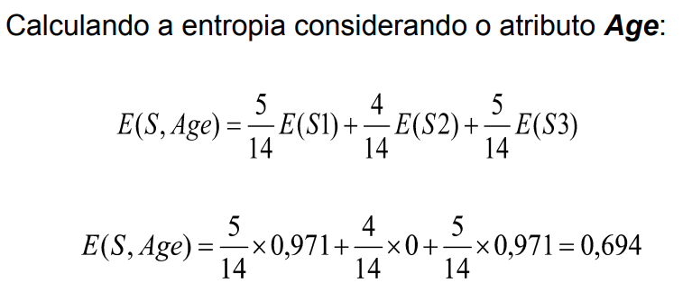
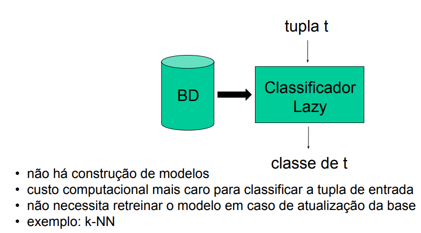

# Resumo IA - AB2
# Classificação:
Identificação da classe a qual um elemento pertence a partir de suas características. Conjunto de possíveis classes é discreto e predefinido.

### Exemplos:
* A partir das características de um eail, determinar se é ou não um SPAM;
* A partir das características de um candidato a um empréstimo, estimar se será um bom ou mau pagador.

### Mineração de um Modelo de Classificação:
#### Objetivo:
Construir um modelo capaz de, dado um novo registro, a partir dos valores dos atributos independentes, determinar o valor do seu atributo dependente(determinar sua classe).

Na base de treinamento, os registros já possuem o valor da classe.

# Arvore de Decisão:
* Nós internos: atributos;
* Arestas: predicados;
* Folhas: valores de classes;
* Nó interno + Aresta: condição.


## Regras de classificação:
* Cada caminho da raiz até a folha representa uma regra, definida como a conjunção das condições percorridas,  implicando no valor da classe encontrada na folha em questão;
* A árvore deve ser definida de forma que, para um mesmo registro, haja um e apenas um caminho da raiz até a folha.


Exemplos:
```
(Sal <= 5k) ⇒ Classe = B
(Sal > 5k) ∧ (Idade > 40) ⇒ Classe = C
(Sal > 5k) ∧ (Idade <= 40) ∧ (TEmpr = Autônomo) ⇒ Classe = A
(Sal > 5k) ∧ (Idade <= 40) ∧ ((TEmpr = Indústria) ∨ (TEmpr = Pesquisa)) ⇒ Classe = B
```

## Taxa de Erro de uma Regra:
É uma classe que não queremos chegar dividido pelo total de instâncias que entraram na condição.

#### Exemplos:
ID | Salary | Age | Employment | Group
---|--------|-----|------------|-------
1  |   30K  |  30 |   Self     |   B
2  |   40K  |  35 |  Industry  |   B
...|   ...  | ... |    ...     |  ...
9  |   40K  |  45 |  Industry  |   B

```
(Salary <= 50K) => Group = B erro: 0%
```

ID | Salary | Age | Employment | Group
---|--------|-----|------------|-------
...|   ...  | ... |     ...    |  ...
6  |   60K  |  35 |   Industry |   B
...|   ...  | ... |     ...    |  ...
11 |   60K  |  35 |   Industry |   B
12 |   70K  |  30 |   Industry |   B
13 |   60K  |  30 |   Industry |   A

```
(Salary>50K) and (Age <= 40) and (Employment = Industry) => Group = B erro: 25%
```

ID | Salary | Age | Employment | Group
---|--------|-----|------------|-------
...|   ...  | ... |     ...    |  ...
7  |   60K  |  35 |     Self   |   A
8  |   70K  |  30 |     Self   |   A
10 |   70K  |  35 |     Self   |   B
...|   ...  | ... |     ...    |  ...

```
(Salary > 50K) and (Age <= 40) and (Employment = Self) => Group = A erro: 33%
```

ID | Salary | Age | Employment | Group
---|--------|-----|------------|-------
...|   ...  | ... |     ...    |  ...
3  |   70K  |  50 |   Academia |   C
4  |   60K  |  45 |     Self   |   C
...|   ...  | ... |     ...    |  ...

```
(Salary > 50K) and (Age > 40) => Group = C erro: 0%
```

## Taxa de Erro de uma Árvore de Decisão:
A taxa de erro total equivale à soma ponderada das taxas de erro de cada folha, considerando-se a probabilidade, associada a cada folha.

```
Erro total = 0.25 * x + 0.33 * y
x = 4 / 13
y = 3 / 13
Erro total = 0.25 * (4 / 13) + 0.33 * (3 / 13)
Erro total = 0.15
```

## Mineração de Árvores de Decisão: (Algoritmo ID3)
* Utilizado para construir árvores de decisão

### Entrada:
* base de treinamento que contém os registros;
* lista dos atributos independentes;
* definição do atributo dependente (classe).

### Saída:
* Árvore de decisão que permite definir o valor da classe de um novo registro a partir de seus atributos independentes.

### Como escolher o atributo:
* ID3 utiliza uma medida conhecida como **Ganho de Informação** que se baseia no conceito de entropia;
* Heurística para selecionar o atributo, tentando minimizar o número de testes necessários para classificar um registro.

#### Medida Ganho de Informação:
Mede quão bem um determinado atributo separa os registros de treino de acordo com o valor da classe. 

* Entropia: medida da quantidade de “desordem” de um conjunto de registros.
* Ganho(Atr): redução da entropia escolhendo-se Atr.
* Ganho(Atr) = E(S) - E(S,Atr), onde:
  * E(S): entropia de uma partição S da base.
  * E(S,Atr): entropia, considerando-se o particionamento de S de acordo com os valores do atributo Atr.

##### Exemplo:





# K-NN(k-Nearest Neighbor):
* Baseiam-se na ideia de aprendizagem por analogia,  ou seja, a classe de uma tupla de entrada será determinada pelo conhecimento das classes de tuplas similares da base de treinamento;
* Cada tupla possui n atributos e, portanto, pode ser caracterizada por um ponto em um espaço n-dimensional;
* A técnica procura pelas k tuplas de treinamento mais próximas à tupla a ser classificada no espaço n-dimensional. Essas tuplas serão os k vizinhos mais próximos;
* Depois de identificados os k vizinhos mais próximos da tupla t
de entrada a ser classificada, o k-NN atribui a t a classe
predominante entre esses k vizinhos;
* O classe atribuída pode variar de acordo com o valor do
parâmetro k escolhido;
Um valor adequado de k pode ser escolhido empiricamente (experiência prática, opondo-se à teoria).

## Classificadores K-NN:
* Proximidade (ou semelhança, similaridade) é definida a partir
de uma métrica de distância;
  * Exemplo: Euclidiana. (dist(x, y)) = sqrt((X2 - x1)² + (y2 - y1)²)
* Essa fórmula exige atributos numéricos;
* Quanto menor dist(x, y), mais próximos, semelhantes, similares são as tuplas x e y.
* Normalização [0, 1] dos valores dos atributos para evitar que atributos diferentes (Exemplo: idade e salário) contribuam de formas diferentes no cálculo da distância.

## Observações:
* De uma forma geral, o k-NN apresenta um alto custo computacional para classificar uma nova tupla t, pois tem que calcular a distância de t para todas as tuplas da base.
* Por outro lado, a atualização da base é automaticamente
refletida no classificador.


# Comparações Classificadores Eager(Árvore de Decisão) e Lazy(K-NN):

## Eager:


## Lazy:
