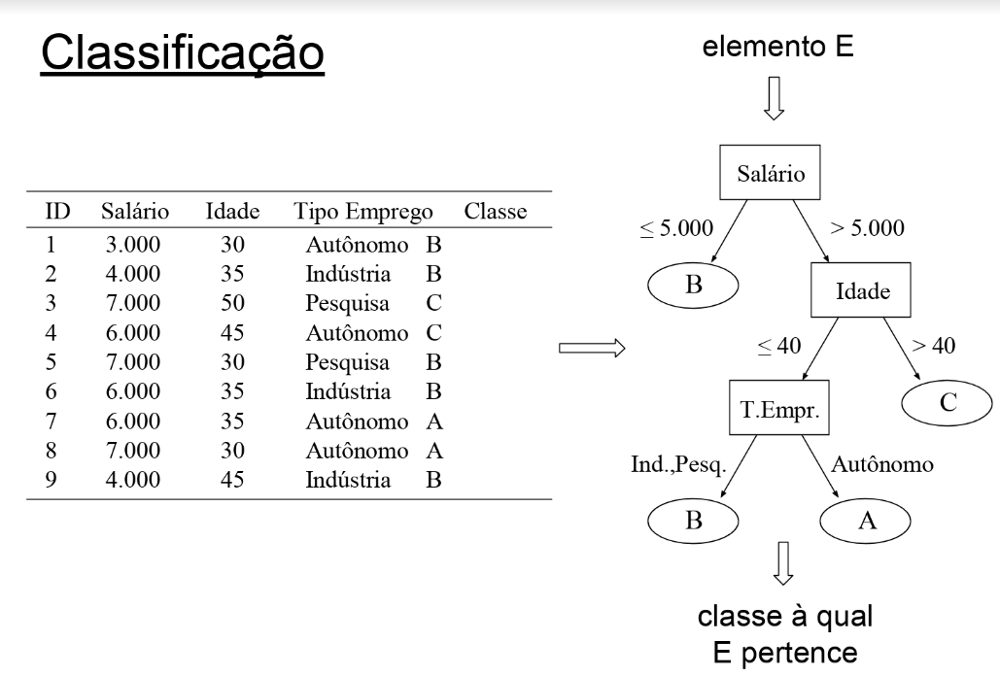
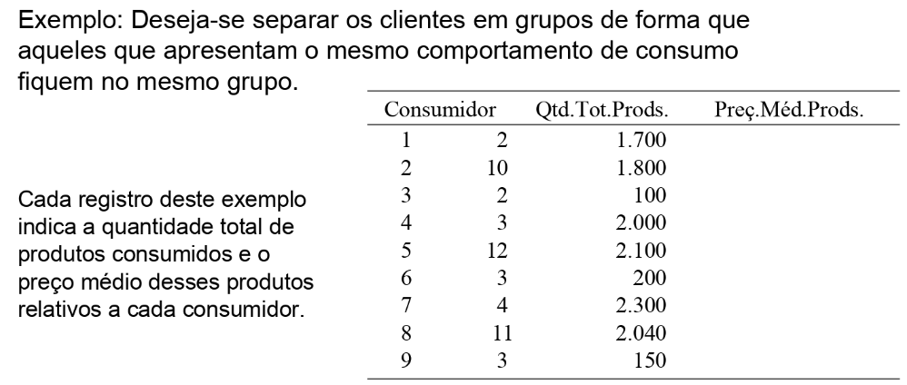
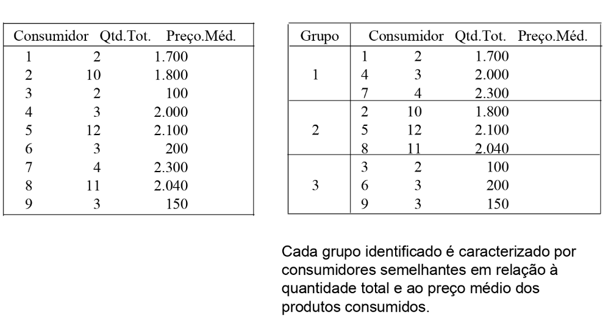

# Resumo IA - AB2
# Mineração de Dados (Data Mining)

## Introdução:
Mineração de Dados (Data Mining): Processo de descoberta de novas informações
e conhecimento, no formato de **regras e padrões**, a partir de grandes bases de dados.

## Tipos de mineração de dados:
* Preditiva: deseja-se prever o valor desconhecido de um determinado atributo, a partir da análise histórica dos dados armazenados na base.
* Descritiva: padrões e regras descrevem caractéristicas importantes dos dados com os quais se está trabalhando.

## Mineração de Dados: 
Etapa principal do processo de KDD(Knowledge Discovery in Databases)(Descoberta de conhecimento em Bases de Dados), na qual é realizada a busca por novas informações e conhecimento.

O processo de **KDD** é composto por seis fases(Navathe):
* Seleção dos dados;
* Limpeza dos dados;
* Enriquecimento dos dados;
* Transformação dos dados;
* **Mineração dos dados**;
* Apresentação e análise dos resultados.

## Tarefas em Mineração de Dados:
* Regras de associação;
* Classificação;
* Clusterização.

### Regras de associação:
Uma regra de associação representa um padrão de relacionamento entre itens de dados do domínio da aplicação que ocorre com uma determinada freqüência na base.

Exemplos: 
* {fralda} => {cerveja}
  * parte significativa das compras de homens, às sextas à noite, que inclui fraldas, inclui também cerveja.
* {pão, manteiga} => {leite}
  * o cliente que compra pão e manteiga, 80% das vezes compra leite.
* {candidíase} => {pneumonia}
  * muitos pacientes aidéticos que contraem a doença candidíase também têm pneumonia

As **regras de associação** são extraidas da base de dados que contêm transações - formadas por conjuntos de itens do domínio da aplicação.

**Padrões de sequências** representam sequências de conjuntos de itens que ocorrem nas transações de diferentes consumidores, com determinada frequência na ordem específica.

### Classificação:
* Identifica, entre um conjunto pré-definido de classes, aquela a qual pertence um elemento, a partir de seus atributos.
    * Implementar/minerar um classificador significa gerar/descobrir a função que realiza tal mapeamento;
    * O processo de classificação precisa de uma base de treinamento.

### Clusterização (Agrupamento)
* É o resultado da identificação de um conjunto finito de categorias (ou grupos - clusters) que contêm objetos similares.
  * Grupos não são previamente definidos.

## Técnicas de mineração de dados:

Tarefa        |      Técnicas
--------------|-------------------
Classificação | Árvores de Decisão / K-NN / Classificador Bayesiano
Associação    | Algoritmos de Extração de Regras de Associação
Clusterização | Algoritmos de Particionamento / Algoritmos Hierárquicos

## Aplicações das Técnicas de MD:
* Marketing:
  * Análise do comportamento dos clientes baseada no padrão de compras.
* Finanças:
  * Análise do risco na concessão de empréstimos.
* Saúde:
  * Previsão dos resultados de determinados tratamentos.
* Educação:
  * Avaliação da evasão escolar e do desempenho de alunos.
* Segurança:
  * Identificação de roubo de cartão de crédito, detecção de SPAM.