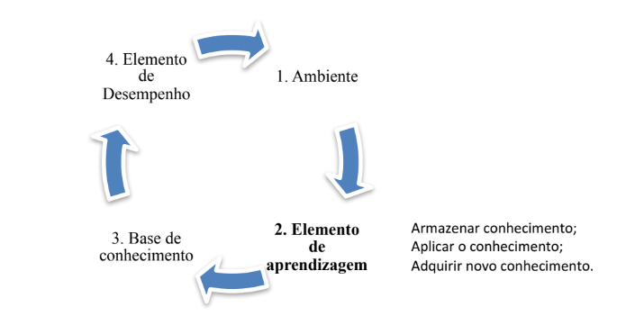
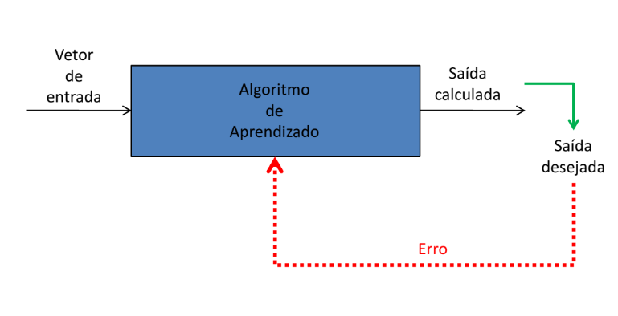
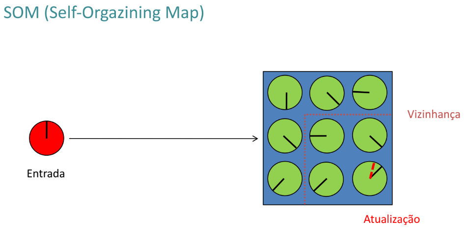
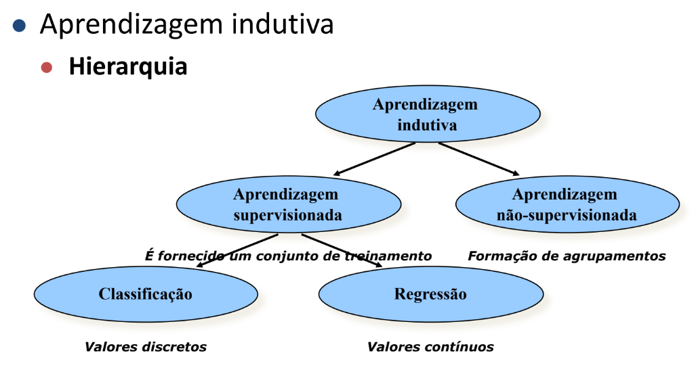

# Resumo IA - AB2
# Formas de representar conhecimento:
* Funções
* Tabelas
* Gráficos
* Mapas mentais

# Aprendizagem de Máquina:
## Conceito formal:
Aprendizado de máquina é a área de Inteligência Artificial cujo objetivo
é o desenvolvimento de técnicas computacionais sobre processo de aprendizado.

## Aprender?
Aprender pode ser caracterizado como a capacidade de obter melhor desempenho
baseado na experiência.

"Um programa aprende a partir da experiência E, em relação a uma classe de
tarefas T, com medida de desempenho P, se seu desempenho em T, medido por P,
melhora com E" Mitchell.

### Exemplo:
Detecção de bons clientes para um cartão de crédito:
* Tarefa T: classificar potenciais novos clientes como bons ou maus pagadores;
* Medida de Desempenho P: porcentagem de clientes classificados corretamente;
* Experiência de Treinamento E: uma base de dados histórica em que os clientes
já conhecidos são previamente classificados como bons ou maus pagadores.

## Quando usar? (2 casos)
* Quando não é conhecido um algoritmo que resolva o problema;
* Ambientes dinâmicos (algoritmos para cada caso específico).

## O que aprender?
Fazer com que a máquina aprenda somente o necessário (mínimo possível necessário),
se souber programar para resolver o problema, programe!

Abstrair o problema real, modelar e dar para a máquina aprender somente
o necessário.

## Formas de Aprendizagem:
O campo de Aprendizado de Máquina distingue três casos:
* Aprendizado Supervisionado*;
* Aprendizado Não-Supervisionado*;
* Aprendizado por Reforço.

# Aprendizagem Supervisionado:
* É fornecida uma referência do objetivo a ser alcançado:
  * O algoritmo recebe o valor de saída desejado para cada conjunto de dados de entrada apresentado.
* Envolve o aprendizado de uma função a partir de exemplos de sua entrada e saída.
* Valores discretos: Problema de classificação;
* Valores contínuos: Problema de regressão;

## Exemplos de Algoritmos:
* Árvores de decisão;
* KNN;
* Redes Neurais(BP);
* SVM;
* TBL.

## Procedimentos Básicos de Treinamento:
1. Coletar grande conjunto de exemplos;
2. Dividir o conjunto em dois sub-conjuntos distintos:
   * Conjunto de Treinamento(70%)
   * Conjunto Teste(30%)
3. Treinar o algoritmo de aprendizado junto ao conjunto de treinamento
4. Simular o algoritmo de aprendizado treinado no conjunto de testes e medir a porcentagem de exemplos corretamente classificados.
5. Repetir os passos de 1 a 5 para diferentes tamanhos de conjuntos de treinamento e diferentes conjuntos de treinamento.

# Aprendizagem Não-Supervisionado:
* É fornecido somente o conjunto de dados de entrada;
  * Não existe "a" saída desejada.
* Envolve a aprendizagem de padrões na entrada quando não são aprendesentados valores de saída específicos;
* Em geral, é utilizado para encontrar aglomerados de conjuntos de dados semelhantes entre sí(clusters)

## Exemplos de algoritmos:
* C-means
* K-means
* Redes-Neurais(SOM)
* Clusters

# Aprendizagem por indução:

## Construção de conhecimento por um agente:
### Questões envolvidas:
O que **aprender**?
* Aumentar/refinar **conhecimento** do agente:
  * Propriedades relevantes do mundo
  * Como o mundo evolui
  * Resultados das ações
  * Adequações de ações num dado contexto
* Aumentar **eficiência** do agente(não precisa mais refletir)

Como **representar** o que aprender?
* Vários formalismos
* Eficiência vs Expressividade

Qual é o **feedback** disponível?
* Supervisionado: certo ou errado
  * Exemplo: Concessão de crédito
* Não supervisionado:
  * Descobrir relações (e hierarquias) entre objetos quaisquer
* Por reforço: recompensa/punição
  * Exemplo: Jogo de xadrez

Qual é o **conhecimento prévio** disponível?
* Em geral, existe e é importante:
  * Exemplo: Artistas e médico chegam a conclusões diferentes para as mesmas observações.
* IA simbólica captura melhor este conhecimento.
* Influi também da descrição dos exemplos.
  * Exemplo: Paraíba, Pernambuco, Alagoas => NE.

## Tipos de aprendizagem indutiva:
* Incremental: atualiza hipótese a cada novo exemplo:
  * Mais flexível, situada, ... porém a ordem de apresentação é importante (backtracking).
* Não-incremental: gera h a partir de todo conjunto de
exemplos:
    * Mais eficiente e prática.